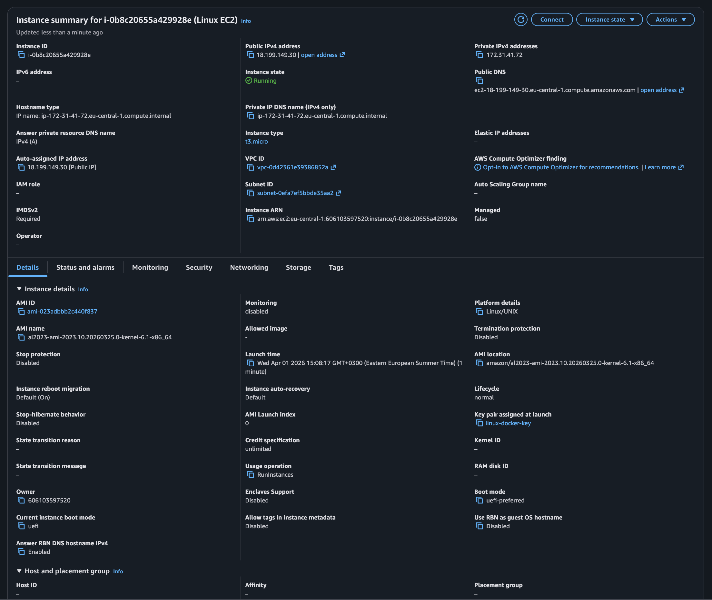
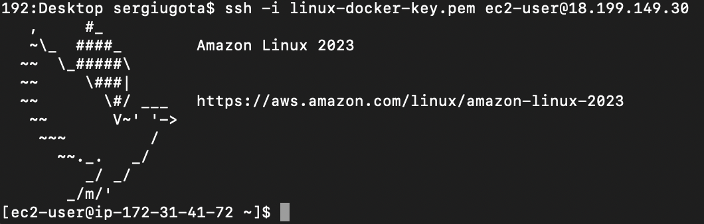
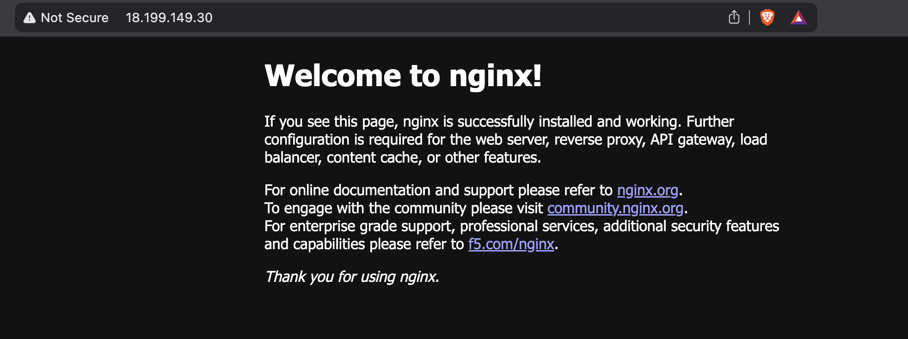
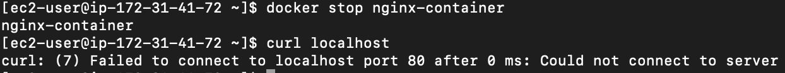
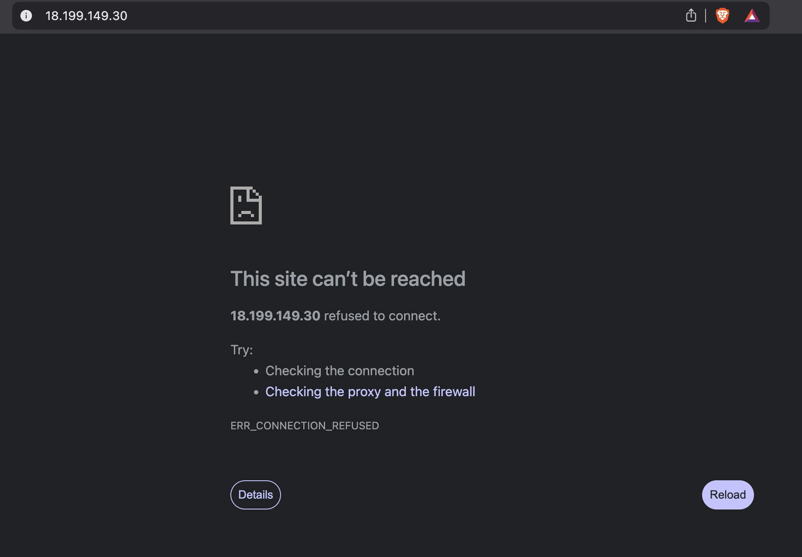
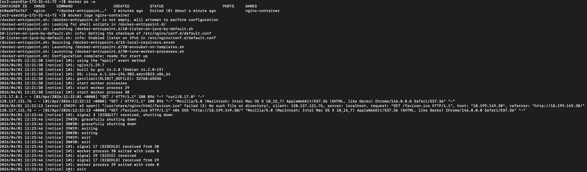
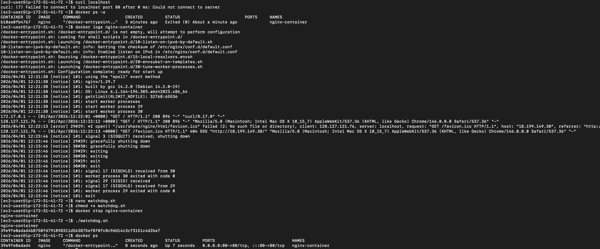
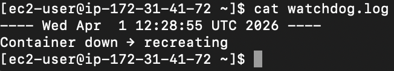
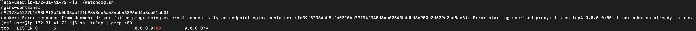

# Linux Self-Healing Web Server on AWS

### Linux Systems Operations · EC2 · Amazon Linux 2023 · Docker · Bash · Process Management · Linux Networking

[](https://www.kernel.org/)
[](https://www.gnu.org/software/bash/)
[](https://www.docker.com/)
[](https://aws.amazon.com/)
[](https://aws.amazon.com/linux/amazon-linux-2023/)

---

## Overview

This project demonstrates Linux systems operations skills on AWS EC2 — not deployment, but what happens when things break.

A Dockerised Nginx web server is intentionally failed in two distinct ways. Each failure is diagnosed using Linux tools (`ss`, `ps`, `journalctl`, `docker logs`), resolved at the process and network level, and recovered automatically via a Bash watchdog script. The focus throughout is on Linux-level thinking: understanding process ownership, port binding, service lifecycle, privilege boundaries, and log-driven debugging.

This is the kind of work that happens after `terraform apply` — when a service goes down at 2am and someone has to figure out why.

**Region:** eu-central-1 · **OS:** Amazon Linux 2023 · **Access:** SSH via key pair · **Linux skills demonstrated:** process management, networking tools, service control, Bash automation, privilege escalation

---

## The Problem

Most cloud tutorials stop at deployment. Service is up, screenshot taken, project closed.

Production environments don't work that way.

Containers crash. Processes compete for ports. Services go down without warning. And when they do, someone has to:

- Know **how** to detect the failure
- Know **what tools** to use to diagnose it
- Know **how to fix it** without breaking something else
- Ideally, have **automated** the recovery before it was needed

This project treats that gap as the actual problem to solve. The web service itself is simple — an Nginx container on port 80. The engineering is in the failure handling.

---

## Architecture

```
User → Browser → EC2 Public IP (port 80)
                        │
                        ▼
              Docker Engine (Amazon Linux 2023)
                        │
                        ▼
            nginx-container (port 80:80)
                  ↕ monitored by
            Bash Watchdog (watchdog.sh)
                        │
                        ▼
            watchdog.log (timestamped events)
                        │
              ┌─────────┴─────────┐
              ▼                   ▼
       Failure Type 1      Failure Type 2
     Container Crashed     Port Conflict
       docker stop         python3 on :80
              │                   │
              ▼                   ▼
        Detected via         Detected via
        docker ps            ss -tulnp
              │                   │
              └─────────┬─────────┘
                        ▼
               Service Restored
               watchdog.sh + kill + docker run

Infrastructure
├── EC2 (t3.micro)
│   ├── Amazon Linux 2023
│   ├── Docker Engine
│   └── nginx-container (public port 80)
│
├── Security Group
│   ├── SSH (22) → 0.0.0.0/0
│   └── HTTP (80) → 0.0.0.0/0
│
└── Watchdog Layer
    ├── watchdog.sh — detection + recovery logic
    ├── watchdog.log — timestamped incident log
    └── cron (optional) — * * * * * ./watchdog.sh
```

---

## Failure Scenarios Demonstrated

| Scenario | Cause | Detection Method | Fix |
|---|---|---|---|
| **Container crash** | `docker stop nginx-container` | `docker ps` — container missing | `docker run` restart |
| **Port conflict** | `sudo python3 -m http.server 80` | `ss -tulnp \| grep :80` + `ps aux` | `sudo kill -9 <PID>` |
| **Permission denied on kill** | root-owned process | `kill` fails for ec2-user | `sudo kill -9 <PID>` |
| **Package manager mismatch** | AL2 command on AL2023 | `amazon-linux-extras: command not found` | Switch to `dnf` |

---

## Tools Used

| Tool | Purpose |
|---|---|
| **AWS EC2 (t3.micro)** | Linux host running the full stack |
| **Amazon Linux 2023** | Modern OS — uses `dnf`, not `amazon-linux-extras` |
| **Docker** | Containerised Nginx deployment |
| **Bash** | Watchdog script — detection, recovery, logging |
| **cron** | Scheduled watchdog execution (optional automation layer) |
| **`docker ps / logs`** | Container state inspection and log analysis |
| **`ss -tulnp`** | OS-level port binding verification |
| **`ps aux`** | Process identification during port conflict |
| **`kill / sudo kill`** | Process termination — with privilege awareness |
| **`curl`** | Local service health check |
| **`systemctl`** | Docker service lifecycle management |

---

## Execution Flow

### Failure 1 — Container Crash

1. Nginx container is deployed and serving traffic on port 80
2. Container is stopped (`docker stop nginx-container`) — service goes down
3. `docker ps -a` confirms container is in `Exited` state
4. `docker logs nginx-container` reveals graceful shutdown signal (`SIGQUIT`) — nginx shut down correctly, it was not a crash, it was an intentional stop simulating an unplanned exit
5. Watchdog script detects missing container via `docker ps | grep -q nginx-container`
6. Script removes stale container reference, runs fresh `docker run -d -p 80:80 --name nginx-container nginx`
7. Service restored — confirmed via `docker ps` and `curl localhost`
8. Incident logged to `watchdog.log` with timestamp

### Failure 2 — Port Conflict

1. Python HTTP server is started on port 80 as a competing process (`sudo python3 -m http.server 80`)
2. Container is stopped — watchdog attempts recovery
3. Docker fails: `Error starting userland proxy: listen tcp4 0.0.0.0:80: bind: address already in use`
4. `ss -tulnp | grep :80` confirms port 80 is occupied
5. `ps aux | grep http.server` identifies the blocking process and its PID
6. `sudo kill -9 <PID>` terminates the root-owned process — plain `kill` fails (permission denied)
7. Port verified free via `ss -tulnp | grep :80` — no output
8. Watchdog re-run — container starts successfully
9. Final state confirmed: `docker ps` shows container `Up` with `0.0.0.0:80->80/tcp`

---

## Watchdog Script

```bash
#!/bin/bash

LOGFILE="/home/ec2-user/watchdog.log"

echo "---- $(date) ----" >> $LOGFILE

# Check if container is running
if ! docker ps | grep -q nginx-container
then
  echo "Container down → recreating" >> $LOGFILE
  
  docker rm nginx-container 2>/dev/null
  
  docker run -d -p 80:80 --name nginx-container nginx
fi
```

The script is intentionally minimal — one condition, one action, one log entry per run. In production this would be extended with exit code capture, alerting via SNS or PagerDuty, and a DLQ equivalent for failed recovery attempts.

---

## Project Structure

```
linux-self-healing-server/
│
├── bash/
│   └── watchdog.sh                  # Failure detection + container recovery
│
├── screenshots/
│   ├── 01-ec2-instance-running.png
│   ├── 02-ssh-connection-success.png
│   ├── 03-docker-installed.png
│   ├── 04-nginx-running-browser.png
│   ├── 05-container-stopped.png
│   ├── 06-site-down-browser.png
│   ├── 07-docker-logs-analysis.png
│   ├── 08-watchdog-recovery.png
│   ├── 09-watchdog-log.png
│   ├── 10-port-conflict-error.png
│   ├── 11-port-debug-ss-command.png
│   ├── 12-process-identification-ps.png
│   ├── 13-port-free-confirmation.png
│   └── 14-final-recovery-success.png
│
├── .gitignore
└── README.md
```

---

## Deployment

### Prerequisites

- AWS account with EC2 access
- Key pair (`.pem`) downloaded and permission-locked
- Security group with ports 22 and 80 open

### Launch EC2

1. AMI: Amazon Linux 2023
2. Instance type: t3.micro
3. Key pair: create and download `.pem`
4. Security group: SSH (22) + HTTP (80) from anywhere

### Connect

```bash
chmod 400 linux-docker-key.pem
ssh -i linux-docker-key.pem ec2-user@<PUBLIC-IP>
```

### Install Docker

```bash
sudo dnf install docker -y
sudo systemctl start docker
sudo systemctl enable docker
sudo usermod -aG docker ec2-user
exit  # Reconnect to apply group change
```

> **Note:** Amazon Linux 2023 uses `dnf`. The older `amazon-linux-extras install docker` command is invalid on AL2023 and will fail silently.

### Deploy Service

```bash
docker run -d -p 80:80 --name nginx-container nginx
docker ps
curl localhost
```

### Deploy Watchdog

```bash
nano watchdog.sh
# paste script content
chmod +x watchdog.sh
```

### Test Recovery

```bash
docker stop nginx-container   # Simulate failure
./watchdog.sh                 # Trigger recovery
docker ps                     # Confirm restored
cat watchdog.log              # Review incident log
```

### Optional — Automate with Cron

```bash
crontab -e
# Add:
* * * * * /home/ec2-user/watchdog.sh
```

---

## Screenshots (End-to-End Proof)

### Infrastructure


### Access


### Environment Setup


### Service Running (Baseline)


### Failure Simulation



### Debugging


### Automated Recovery



### Port Conflict (Advanced Failure)



### Full Recovery


---

## Engineering Decisions

**Why Docker instead of Nginx installed directly on the host?**
Installing Nginx directly on the host works but creates tight coupling between the service and the OS. A container is a portable, restartable unit — the watchdog can `docker rm` a broken container and start a clean one without touching host configuration. This also simulates the pattern used in real deployments where services run as containers managed by an orchestrator.

**Why Bash for the watchdog instead of a proper monitoring tool?**
Tools like CloudWatch alarms, Datadog, or Prometheus are the right production answer. But they abstract away the underlying logic. Using Bash makes the mechanism explicit: check condition, log result, take action. Every line is visible. This demonstrates understanding of the recovery pattern, not just the ability to configure a SaaS tool.

**Why simulate port conflict specifically?**
Port conflicts are one of the most common and confusing failure modes in shared environments — multiple services competing for the same port, a crashed process that didn't release its socket, or a deployment gone wrong that left a ghost process behind. Simulating it and resolving it with `ss`, `ps`, and `kill` proves familiarity with Linux networking at the process level, not just the Docker level.

**Why did `kill -9` fail on the first attempt?**
The python server was started with `sudo`, making it a root-owned process. As `ec2-user`, `kill` is not permitted on root-owned PIDs — the kernel enforces process ownership. `sudo kill -9` bypasses this. This is a real-world permission boundary that causes confusion in shared Linux environments and is worth understanding explicitly.

**Why note the `dnf` vs `amazon-linux-extras` difference?**
Amazon Linux 2023 dropped `amazon-linux-extras` entirely. Running `sudo amazon-linux-extras install docker` on AL2023 produces either a command-not-found error or does nothing useful. The correct command is `sudo dnf install docker`. This is a practical difference that breaks copy-pasted tutorials, and recognising it is a sign of reading the environment rather than following a script.

**Why log to a file instead of stdout?**
Logging to `watchdog.log` creates a persistent, queryable record of incidents. Stdout disappears when the session closes. A log file survives reboots (in this case), can be tailed in real time, and can be forwarded to CloudWatch Logs or an S3 bucket for centralised storage. The pattern is the same regardless of scale.

---

## Troubleshooting

### 1. Docker command not found after install

**Problem:** `docker: command not found` even after install

**Cause:** Group change (`usermod -aG docker ec2-user`) requires a new session to take effect

**Fix:**
```bash
exit
# Reconnect via SSH
docker ps
```

---

### 2. amazon-linux-extras not found

**Problem:** `sudo amazon-linux-extras install docker -y` fails

**Cause:** AL2023 removed this tool entirely

**Fix:**
```bash
sudo dnf install docker -y
```

---

### 3. kill -9 returns "Operation not permitted"

**Problem:** Cannot kill process occupying port 80

**Cause:** Process was started with `sudo` — owned by root, not ec2-user

**Fix:**
```bash
sudo kill -9 <PID>
```

---

### 4. Port 80 still occupied after kill

**Problem:** `ss -tulnp | grep :80` still shows listener after killing PID

**Cause:** Multiple related processes (sudo wrapper + child process) — all must be killed

**Fix:**
```bash
ps aux | grep http.server   # identify all PIDs
sudo kill -9 <PID1> <PID2> <PID3>
ss -tulnp | grep :80        # verify free
```

---

### 5. Watchdog runs but container doesn't start

**Problem:** Watchdog executes, logs "recreating", but `docker ps` shows nothing

**Cause:** Port conflict — container creation fails silently in the script

**Fix:**
```bash
ss -tulnp | grep :80        # check for port occupancy
ps aux | grep <process>     # identify blocking process
sudo kill -9 <PID>
./watchdog.sh               # retry
```

---

## What I Learned Building This

1. **Package managers matter** — AL2023 dropped `amazon-linux-extras`. Running old commands on a new OS is a real debugging skill, not a trivial mistake.
2. **Port binding is an OS-level concept, not a Docker one** — `ss` and `lsof` reveal what Docker cannot tell you.
3. **Process ownership governs kill permissions** — root-owned processes require `sudo kill`, and knowing why matters more than knowing the fix.
4. **Containers don't restart themselves by default** — Docker has `--restart` policies, but understanding the manual recovery flow first is the right order of learning.
5. **Logs are the product** — a script that recovers silently is worse than one that logs. The `watchdog.log` is as important as the watchdog itself.
6. **Failure simulation is harder than deployment** — setting up Nginx takes two minutes. Engineering a clean failure → debug → recovery cycle takes real thought.

---

## Production Improvements

- **Docker restart policy** — `--restart unless-stopped` provides container-level self-healing without a watchdog; the watchdog approach is more transparent and diagnosable
- **Systemd service for watchdog** — replace cron with a systemd unit to get proper dependency management, restart limits, and `journalctl` integration
- **CloudWatch Logs agent** — forward `watchdog.log` to CloudWatch for centralised visibility and alarm triggers
- **SNS alerting** — publish to an SNS topic on failure detection so on-call engineers are notified, not just the log file
- **Dedicated security group with IP restriction** — port 22 open to `0.0.0.0/0` is acceptable for a lab; production SSH access should be restricted to a bastion or VPN CIDR
- **Terraform IaC** — full stack provisioned and destroyed as code — EC2, security groups, key pair, IAM role
- **Nginx config validation before reload** — `nginx -t` before applying config changes to prevent bad deploys from taking down the service
- **Health check endpoint** — `curl localhost/health` instead of `curl localhost` for more precise readiness detection

---

## Author

**Sergiu Gota**
AWS Certified Solutions Architect – Associate · AWS Cloud Practitioner

[](https://github.com/sergiugotacloud)
[](https://linkedin.com/in/sergiu-gota-cloud)

> Built as part of a cloud engineering portfolio to demonstrate Linux systems operations skills — process management, OS-level debugging, network diagnostics, and automated recovery using Bash. The web service is the vehicle. Linux is the point.
